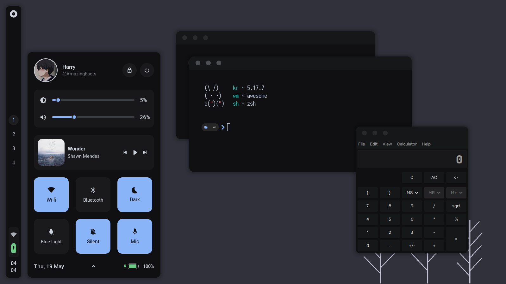
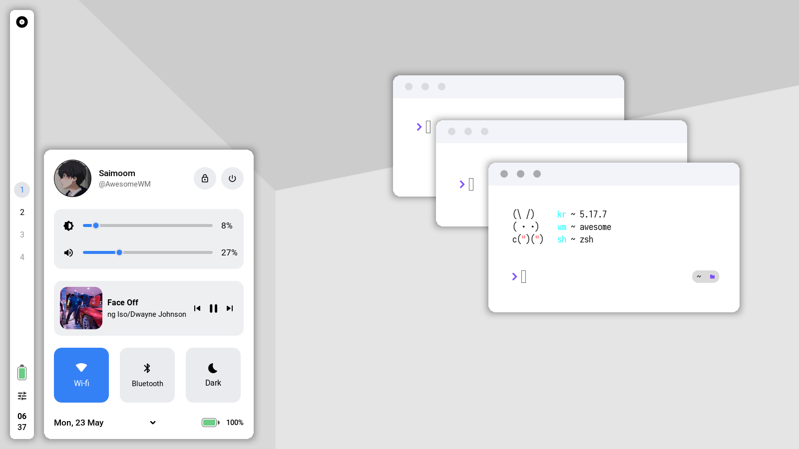

<br>
    <div align="center">
        
    </div>
<br>

<p align="center">
    hello there, welcome to my Awesomewm dotfiles!<br>
    this an <a href="https://awesomewm.org">awesomewm</a> rice/setup that I use as a daily driver.<br>
    <br>
    🫂 you can take anything you like from this repository. but.. please credit me too! 😄 <br>
    <br>
    :star: if you liked it, please star this repo, it really helps me ⭐
</p>

<br>

<p align="center">
    <a href="https://github.com/saimoomedits/dotfiles#info-">Info</a> - 
    <a href="https://github.com/saimoomedits/dotfiles#shots-gallery-">Gallery</a> - 
    <a href="https://github.com/saimoomedits/dotfiles#features-">Features</a> - 
    <a href="https://github.com/saimoomedits/dotfiles#setup-eyes">Setup</a> -
    <a href="https://github.com/saimoomedits/dotfiles#Keybinds">Keys</a> - 
    <a href="https://github.com/saimoomedits/dotfiles#Modules">Mods</a>
</p>

<br>


# info 📖

**setup details**

| task              | name                   |
| ----------------- | ---------------------- |
| WM                | [awesome-git](https://github.com/awesomeWM/awesome)                                      |
| terminal          | [alacritty](https://github.com/alacritty/alacritty)                                      |
| music player      | [mpd](https://www.musicpd.org/) & [ncmpcpp](https://github.com/ncmpcpp/ncmpcpp)          |
| Light GTK theme   | [Cutefish-light](https://cutefish-ubuntu.github.io/)                            |
| Dark Gtk theme    | Awesthetic-gtk
| bar               | [wibar](https://awesomewm.org/apidoc/popups_and_bars/awful.wibar.html)                   |
| compositor        | [picom-git](https://github.com/yshui/picom)                                  | 

<br>

**more info** 🕵️


<br>

* **Fonts?**
    * as for fonts, the setup uses 4 fonts in total
        - *Roboto* - main ui font
        - *Material Icons* - for icons
        - *Iosevka* - Terminal/Monospace font
        - *JetbrainsMono NF* - idk

<br>

* **gaps/border/titlebar**
    * **titlebars**
        * you can edit `layout/decorations/init.lua` to emend/modify the global titlebar.
    * **borders**
        * border size can be change in `theme/ui_vars.lua`, there is a `border_size`.
    * **gaps**
        * Gaps can also be changed in `theme/ui_vars.lua`.

<br>

* **custom theme?**
    * for dark, edit `theme/colors/dark.lua`
    * for light, edit `theme/colors/light.lua`

<br>


<br>

* **rounded corners**
    * by default, windows are rounded with awesome-wm's `client.shape` property,
    * if you want to use picom instead, do the following,

        - edit `config/others.lua`
        - scroll down to line `256` 
        - either, comment it out or remove that line
        - this will disable rounded windows with awesomeWM
<br>

# shots gallery 📸

1. <details open>
     <summary><strong>dark themed</strong></summary>

     <br>
     


<br>


2. <details close>
     <summary><strong>light themed</strong></summary>

     <br>

    

 </details>

# features 💡

1. minimalstic vertical bar

    <br>

    

<br>

2. expandable control center

    <br>

    

<br>

3. Minimal notifcations with text actions

    <br>

    

<br>

4. custom ncmpcpp UI

    <br>

    

<br>

5. exit screen

    <br>

    

<br>

6. lockscreen

    <br>

    

<br>

6. Minimal tasklist dock with pinned apps

    <br>

    

<br>

**and much more, obviously lol**


# setup :eyes:

**NOTE: The following instructions are for Arch/Arch-based system**


<details open>
<summary><strong>Instructions</strong></summary>

1. Install packages / dependencies
    ```sh
    yay -S picom-git awesome-git acpid git mpd ncmpcpp wmctrl \
    firefox lxappearance gucharmap thunar alacritty neovim polkit-gnome \
    xdotool xclip scrot brightnessctl alsa-utils pulseaudio jq acpi rofi \
    inotify-tools zsh materia-gtk-theme mpdris2 bluez bluez-utils bluez-plugins \
    playerctl redshift cutefish-cursor-themes-git cutefish-icons
    ```

2. Make backup of directories that will be changed (optional)
    ```sh
    cd 
    mkdir .backup_config
    cp -r ~/.config/* .backup_config/
    cp -r ~/.mpd .backup_config/
    cp -r ~/.ncmpcpp .backup_config/
    cp -r ~/.themes .backup_config/
    ```

3. Clone this repo
    ```sh
    cd
    clear
    git clone https://github.com/saimoomedits/dotfiles
    cd dotfiles
    ```

4. Copy the dotfiles in required places
    ```sh
    cp -rf .config/* ~/.config/
    cp -rf extras/mpd ~/.mpd
    cp -rf extras/ncmpcpp ~/.ncmpcpp
    cp -rf extras/fonts ~/.fonts
    cp -rf extras/scripts ~/.scripts
    cp -rf extras/oh-my-zsh ~/.oh-my-zsh
    ```

5. Extract Gtk-theme
    ```sh
    mkdir ~/.themes
    cp ./themes/* ~/.themes
    cd ~/.themes
    tar -xf Awesthetic.tar
    tar -xf Cutefish-light-modified.tar
    rm Awesthetic.tar Cutefish-light-modified.tar
    ```

6. make some files executeable
    ```sh
    cd ~/.config/awesome/misc
    sudo chmod -R +x *
    ```
    
7. Startup services
    ```sh
    systemctl --user enable mpd
    sudo systemctl enable bluetooth
    ```

8. Done
    * if your already logged into awesome, reload it
    * else, Login to AwesomeWM 

<br>

**Enjoy :smile:**

<br>


</details>    

<br>


# Keybinds

* press `super(windows key) + f1` :smile:
* the dock can be opened by hovering bottom edge of primary screen
* the dashboard/notifcenter can be opened by hovering over the right-edge
* the control-Center can either be opened by keybinding `super(windows key) + a` or <br>
    by click on the wifi/battery icon in bar


# Modules

<br>

1. **[Rubato](https://github.com/andOrlando/rubato)**
    * Created by [andOrlando](https://github.com/andOrnaldo)
    * Basically, Allows you to animate a number value in AwesomeWM

2. **[Bling](https://github.com/BlingCorp/bling)**
    * Created by the [BlingCorp](https://github.com/BlingCorp) community
    * Adds a lot more cool modules to AwesomeWM

3. **[Layout-machi](https://github.com/xinhaoyuan/layout-machi)**
    * Created by [xinhaoyuan](https://github.com/xinhaoyaun)
    * Manual layout with interactive editor

4. **Awesome-Dock**
    * Created by [me](https://github.com/saimoomedits)....
    * A tasklist dock with pinned apps
    * you can use it in your config (hopefully)
    * but there are still lots of things to improve
    
    <br>

    <details close>
    <summary><strong>More info</strong></summary>

    <br>

    * you can use this dock in your awesome config. but...

    * the catch is that. you need a spcific icon-theme in `/usr/share/icons` for pinned apps to work properly<br>
    but if your using the exact rice as mine, you don't have to worry about it

    <br>

    * You can customize the dock's colors, size, spacing, hide-timeout, etc in `theme/init.lua`

    <br>

    * example:
        ```lua
        theme.awesome_dock_size = 80
        theme.awesome_dock_pinned = {
            {"xterm", "terminal"},
            {"spotify", "spotify"},
            {"xterm"},
            {"thunar"}
        }
        theme.awesome_dock_color_active = theme.accent
        theme.awesome_dock_color_inactive = theme.fg_color .. "66"
        theme.awesome_dock_color_minimized = theme.accent .. "33"
        theme.awesome_dock_color_hover = theme.fg_color .. "33"
        theme.awesome_dock_color_bg = theme.bg_color
        theme.awesome_dock_disabled = false
        theme.awesome_dock_spacing = 10
        theme.awesome_dock_timeout = 1.2
        ```
    
    * to add more pinned apps you can do the following in `theme.lua`:
        ```lua
        --[[ 
            table example:
            { "app command", "app class"}

            * `app command` is well. the command that launches that app
            * `app class` is the class or name of the app for icons.
        ]]
        theme.awesome_dock_pinned = {
            {"spotify", "spotify"},
            {"xterm"},
            {"thunar"}
        }
        ```

        </details>

    
<br>

# Todos

<br>

- [ ] Make dock's icon-handler identify global icon-theme
- [ ] Improve Ncmpcpp decorations
- [ ] Improve Notifications
- [ ] Polish Awesthetic-gtk-theme
   
<br>

# Credits

* special thanks to :heart:
    * [moonlight-coffee](https://github.com/Moonlight-Coffee)
    * [justleoo](https://github.com/justleoo)

<br>

* also these 🌃 awesome people!
    * [Javacafe01](https://github.com/javacafe01)
    * [manilarome](https://github.com/manilarome)
    * [elenapan](https://github.com/elenapan)
<br>

* extras :sparkles:
    * [awesomeWM](https://github.com/awesomewm/) - The awesome Window Manager
    * [Cutefish](https://cutefish-ubuntu.github.io/) - CutefishOS

<br>

* contributers

    <a href="https://github.com/saimoomedits/dotfiles/graphs/contributors">
    
    </a>

