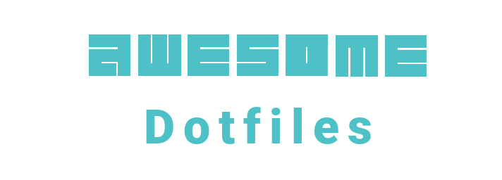
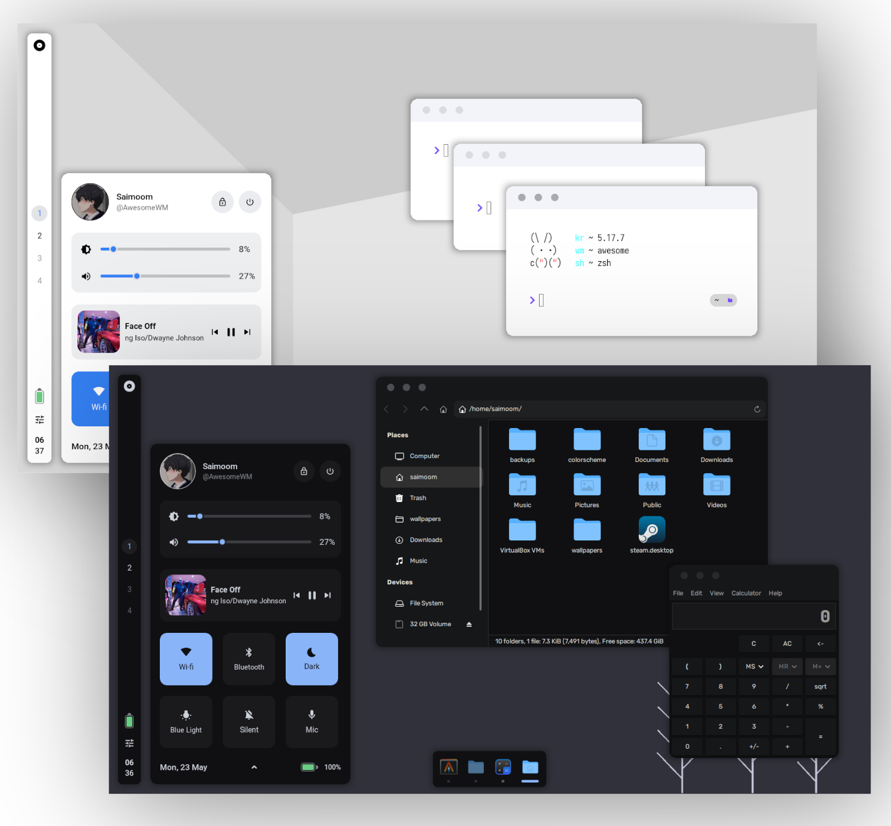
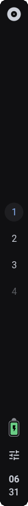
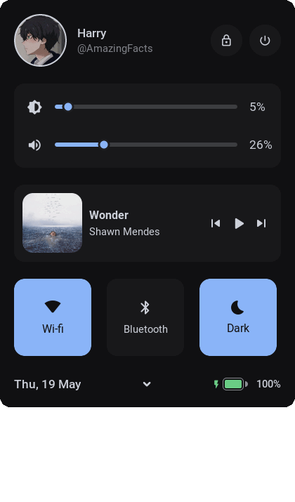
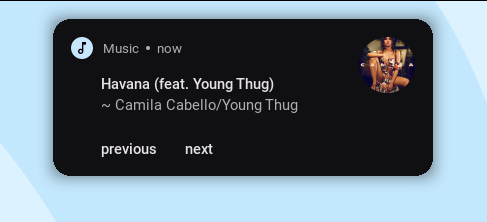
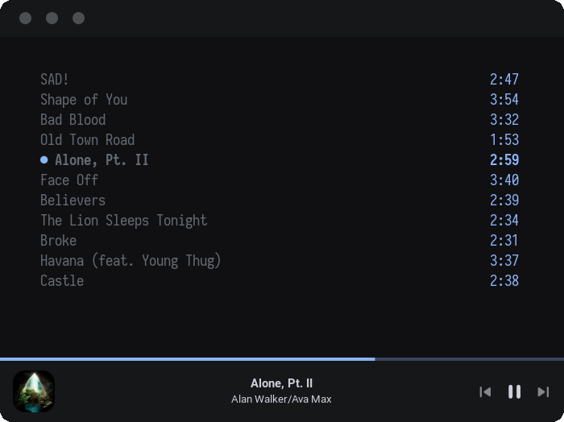
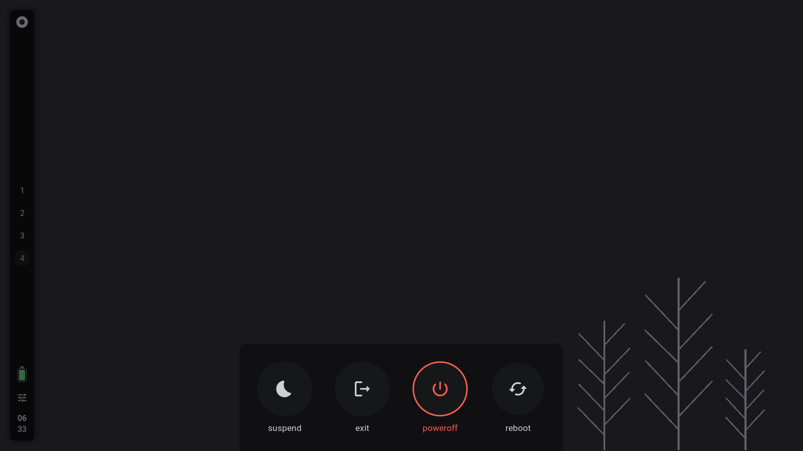
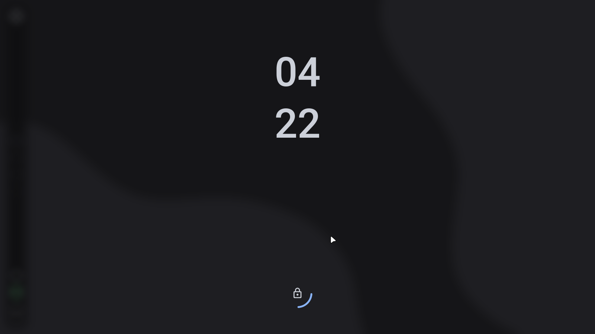
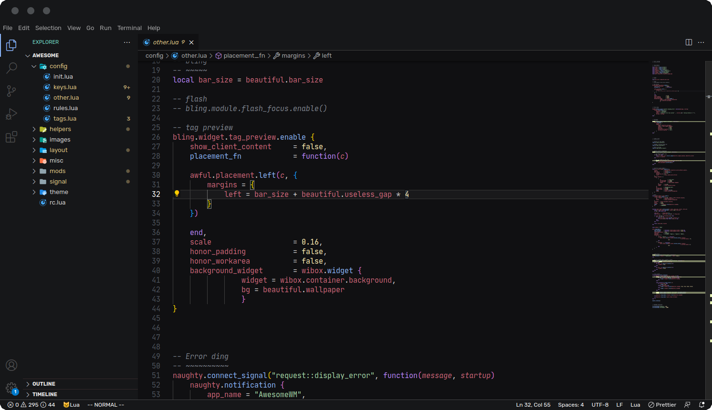

<h1 align="center">
    <div align="center">
        
    </div>
</h1>


<div align="center">
    The <b>Arch Linux & AwesomeWM</b> dotfiles!<br>
</div>

<br>


<div align="center">
    <a href="#features">Features</a>
    ·
    <a href="#setup">Setup</a>
    ·
    <a href="#keybinds">Keys</a>
    ·
    <a href="#modules">Mods</a>
    ·
    <a href="https://github.com/saimoomedits/dotfiles/wiki">Wiki</a>
</div>

<br>

<br>

## <samp><b>Welcome</b></samp> 

<br>

<table align="right">
  <tr>
    <td align="center">
      <sup>
            <samp>
                  If you like this setup, please drop  a star.<br>
                  I really appreciate it.
                  Thanks!
            </samp>
      </sup>
    </td>
  </tr>


<table>

Hi there, thanks for dropping by 💙, 

these are my Arch Linux and AwesomeWM configuration files.

You can use this repository as a **[rice](https://thatnixguy.github.io/posts/ricing/)** reference.

Or use them as a daily driver.

</table>

<br>

### <samp>Setup Info</samp>

<br>




| task              | name                   |
| ----------------- | ---------------------- |
| wm                | [awesome-git](https://github.com/awesomeWM/awesome)                                      |
| terminal          | [alacritty](https://github.com/alacritty/alacritty)                                      |
| music player      | [mpd](https://www.musicpd.org/) & [ncmpcpp](https://github.com/ncmpcpp/ncmpcpp)          |
| Light Gtk theme   | [Cutefish-light](https://cutefish-ubuntu.github.io/)                            |
| Dark Gtk theme    | Awesthetic-gtk
| bar               | [wibar](https://awesomewm.org/apidoc/popups_and_bars/awful.wibar.html)                   |
| compositor        | [picom-git](https://github.com/yshui/picom)                                  | 

<br>


<details close>
    <summary><samp><b>more info</b></samp></summary>


<br>

* **Fonts?**
    * as for fonts, the setup uses 4 fonts in total
        - *Roboto* - main ui font
        - *Material Icons* - for icons
        - *Iosevka* - Terminal/Monospace font
        - *JetbrainsMono NF* - idk

<br>

* **gaps/border/titlebar**
    * **titlebars**
        * you can edit `layout/decorations/init.lua` to emend/modify the global titlebar.
    * **borders**
        * border size can be change in `theme/ui_vars.lua`, there is a `border_size`.
    * **gaps**
        * Gaps can also be changed in `theme/ui_vars.lua`.

<br>

* **custom theme?**
    * for dark, edit `theme/colors/dark.lua`
    * for light, edit `theme/colors/light.lua`

<br>


<br>

* **rounded corners**
    * by default, windows are rounded with awesome-wm's `client.shape` property,
    * if you want to use picom instead, do the following,

        - edit `config/others.lua`
        - scroll down to line `252` 
        - either, comment it out or remove that line
        - this will disable rounded windows with awesomeWM
<br>

</details>


<br>

---

<br>


## <samp><b>features</b></samp>

<br>

* Control Center
* Vertical Bar
* Brightness / Volume OSD
* Lockscreen
* Tasklist Dock
* Light/Dark gtk and zathura theme
* Minimal exitscreen
* Control state saver
* Better Ncmpcpp ui
* Battery notifier
* And many more!

<br>

<details close>
    <summary><samp>Show previews</samp></summary>

<br>

* minimalstic vertical bar

    <br>

    

<br>

* expandable control center

    <br>

    

<br>

* Minimal notifcations with text actions

    <br>

    

<br>

* custom ncmpcpp UI

    <br>

    

<br>

* exit screen

    <br>

    

<br>

* lockscreen

    <br>

    

<br>

* Minimal tasklist dock with pinned apps

    <br>

    

<br>

* Wip vscode theme

    <br>

    

<br>

</details>

<br>

---

<br>

## <samp><b>Setup</b></samp>

<br>


<details open>
<summary><samp>Instructions</samp></summary>

<br>

**⚠️ NOTE: The following instructions are for Arch/Arch-based system ⚠️**

<br>

1. Install packages / dependencies
    ```sh
    yay -S picom-git awesome-git acpid git mpd ncmpcpp wmctrl \
    firefox lxappearance gucharmap thunar alacritty neovim polkit-gnome \
    xdotool xclip scrot brightnessctl alsa-utils pulseaudio jq acpi rofi \
    inotify-tools zsh mpdris2 bluez bluez-utils bluez-plugins acpi acpi_call \
    playerctl redshift cutefish-cursor-themes-git cutefish-icons upower xorg xorg-init tar
    ```

2. Make backup of directories that will be changed (optional)
    ```sh
    cd 
    mkdir .backup_config
    cp -r ~/.config/* .backup_config/
    cp -r ~/.mpd .backup_config/
    cp -r ~/.ncmpcpp .backup_config/
    cp -r ~/.themes .backup_config/
    ```

3. Clone this repo
    ```sh
    cd
    clear
    git clone --recurse-submodules https://github.com/saimoomedits/dotfiles.git
    cd dotfiles
    ```

4. Copy the dotfiles in required places
    ```sh
    cp -rf .config/* ~/.config/
    cp -rf extras/mpd ~/.mpd
    cp -rf extras/ncmpcpp ~/.ncmpcpp
    cp -rf extras/fonts ~/.fonts
    cp -rf extras/scripts ~/.scripts
    cp -rf extras/oh-my-zsh ~/.oh-my-zsh
    ```

5. Extract Gtk-theme
    ```sh
    mkdir ~/.themes
    cp ./themes/* ~/.themes
    cd ~/.themes
    tar -xf Awesthetic.tar
    tar -xf Cutefish-light-modified.tar
    rm Awesthetic.tar Cutefish-light-modified.tar
    ```

6. make some files executeable
    ```sh
    cd ~/.config/awesome/misc
    sudo chmod -R +x *
    ```
    
7. Startup services
    ```sh
    systemctl --user enable mpd
    sudo systemctl enable bluetooth
    ```

8. Done
    * if your already logged into awesome, reload it
    * else, Login to AwesomeWM 

<br>

**Enjoy :smile:**

<br>

*   <details close>
    <summary><samp><b>Vscode theme</b></samp></summary>

    - copy `extras/vscode-theme/Awesthetic` to `~/.vscode/extentions/`.
    - now, in VScode, open the Color Theme picker with `File > Preferences > Color Theme`.
    - select `Awesthetic` theme.

    </details>


</details>    

<br>

---

<br>

## <samp><b>Keybinds</b></samp>

<br>

* you can get a list of keybindings [here in the wiki](https://github.com/saimoomedits/dotfiles/wiki/Keybinds).
* the dock can be opened by hovering bottom edge of primary screen
* the control-Center can either be opened by keybinding `super(windows key) + a` or <br>
    by click on the `control center` icon in bar

<br>

---

<br>

## <samp><b>Modules</b></samp>

<br>

1. **[Rubato](https://github.com/andOrlando/rubato)**
    * Created by [andOrlando](https://github.com/andOrnaldo)
    * Basically, Allows you to animate a number value in AwesomeWM

2. **[Bling](https://github.com/BlingCorp/bling)**
    * Created by the [BlingCorp](https://github.com/BlingCorp) community
    * Adds a lot more cool modules to AwesomeWM

3. **[Layout-machi](https://github.com/xinhaoyuan/layout-machi)**
    * Created by [xinhaoyuan](https://github.com/xinhaoyaun)
    * Manual layout with interactive editor

4. **[Upower battery](https://github.com/Aire-One/awesome-battery_widget.git)**
    * Created by [Aire-One](https://github.com/Aire-One)
    * A UPowerGlib based battery widget for the AwesomeWM.

5. **Awesome-Dock**
    * Created by [me](https://github.com/saimoomedits)....
    * A tasklist dock with pinned apps
    * you can use it in your config (hopefully)
    * but there are still lots of things to improve
    
    <br>

    <details close>
    <summary><samp>More info</samp></summary>

    <br>

    * you can use this dock in your awesome config. but...

    * the catch is that. you need a spcific icon-theme in `/usr/share/icons` for pinned apps to work properly<br>
    but if your using the exact rice as mine, you don't have to worry about it

    <br>

    * You can customize the dock's colors, size, spacing, hide-timeout, etc in `theme/init.lua`

    <br>

    * example:
        ```lua
        theme.awesome_dock_size = 80
        theme.awesome_dock_pinned = {
            {"xterm", "terminal"},
            {"spotify", "spotify"},
            {"xterm"},
            {"thunar"}
        }
        theme.awesome_dock_color_active = theme.accent
        theme.awesome_dock_color_inactive = theme.fg_color .. "66"
        theme.awesome_dock_color_minimized = theme.accent .. "33"
        theme.awesome_dock_color_hover = theme.fg_color .. "33"
        theme.awesome_dock_color_bg = theme.bg_color
        theme.awesome_dock_disabled = false
        theme.awesome_dock_spacing = 10
        theme.awesome_dock_timeout = 1.2
        ```
    
    * to add more pinned apps you can do the following in `theme.lua`:
        ```lua
        --[[ 
            table example:
            { "app command", "app class"}

            * `app command` is well. the command that launches that app
            * `app class` is the class or name of the app for icons.
        ]]
        theme.awesome_dock_pinned = {
            {"spotify", "spotify"},
            {"xterm"},
            {"thunar"}
        }
        ```

        </details>

    
<br>

---

<br>

## <samp><b>Todos</b></samp>

<br>

- [ ] Make dock's icon-handler identify global icon-theme
- [x] Improve Ncmpcpp decorations
- [x] Improve Notifications
- [ ] Polish Awesthetic-gtk-theme
   
<br>

---

<br>

## <samp><b>Credits</b></samp>

* special thanks to :heart:
    * [moonlight-coffee](https://github.com/Moonlight-Coffee)
    * [justleoo](https://github.com/justleoo)

<br>

* also these 🌃 awesome people!
    * [Javacafe01](https://github.com/javacafe01)
    * [manilarome](https://github.com/manilarome)
    * [elenapan](https://github.com/elenapan)
<br>

* extras :sparkles:
    * [awesomeWM](https://github.com/awesomewm/) - The awesome Window Manager
    * [Cutefish](https://cutefish-ubuntu.github.io/) - CutefishOS

<br>

* contributers

    <a href="https://github.com/saimoomedits/dotfiles/graphs/contributors">
    
    </a>

