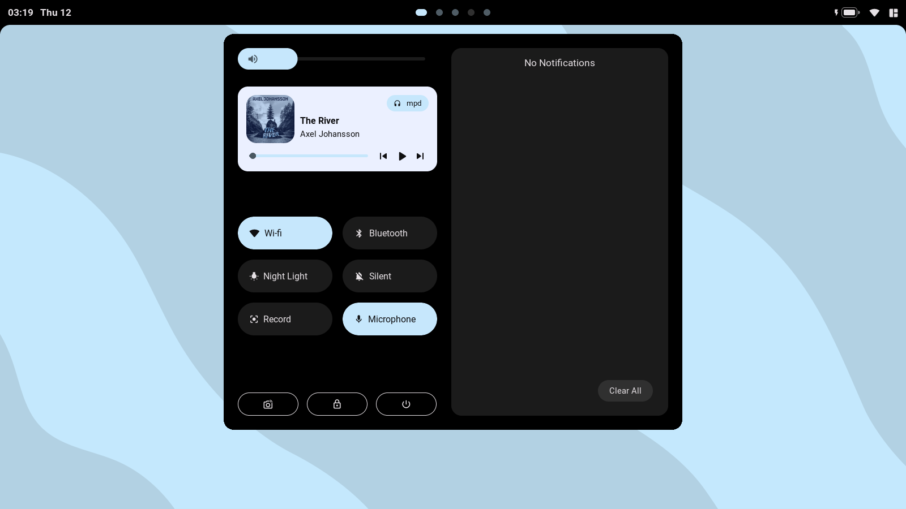
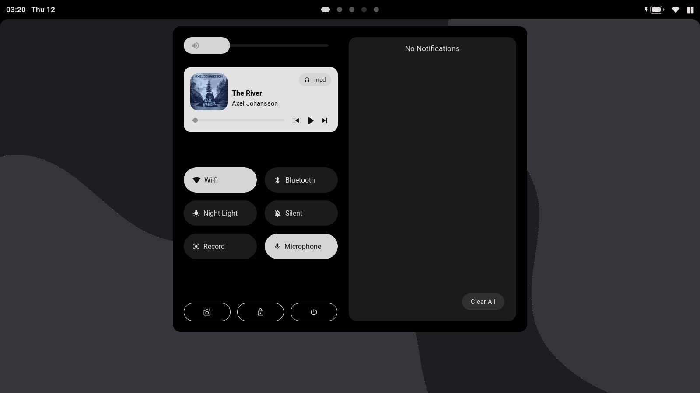
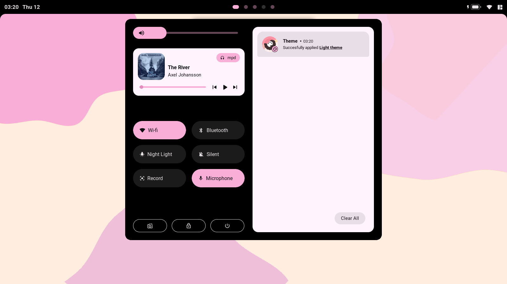
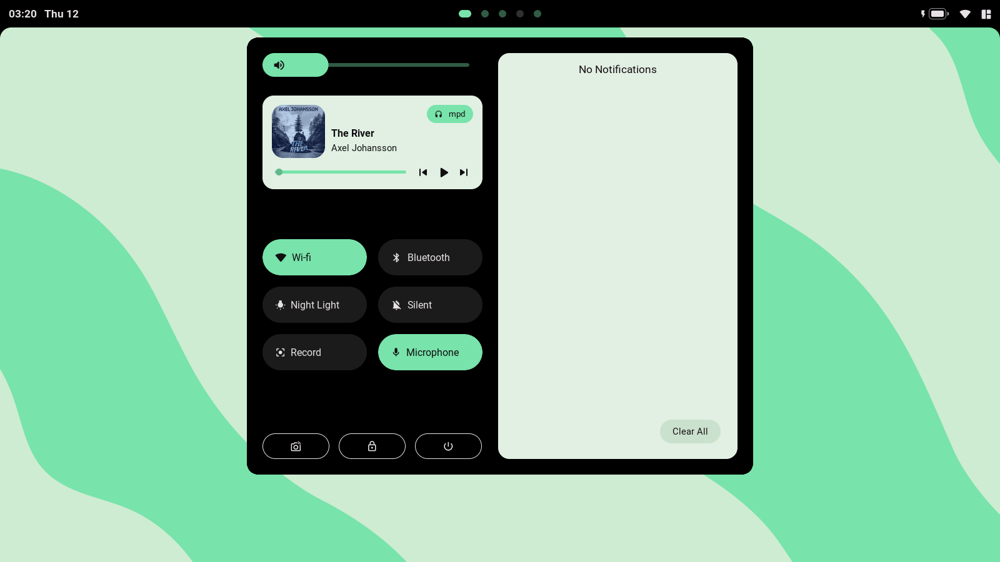
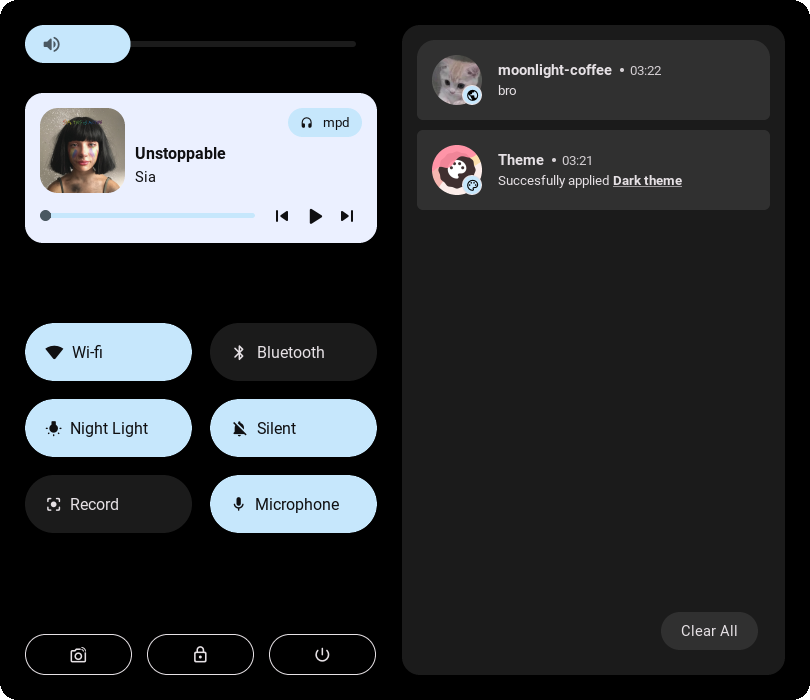

<br>
    <div align="center">
        
    </div>
<br>

<p align="center">
    hello there, welcome to the materialized dotfiles!<br>
    this an <a href="awesomewm.org">awesomewm</a> rice/setup inspired by the infamous <a href="m3.material.com">material you</a>.<br>
    <br>
    🫂 you can take anything you like from this repository. but.. please credit me too! 😄 <br>
    <br>
    :star: if you liked it, please star this repo, it really helps me ⭐
</p>

<br>

<p align="center">
    <a href="https://github.com/saimoomedits/dotfiles/.github/README.md#info-">Info</a> - 
    <a href="https://github.com/saimoomedits/dotfiles/.github/README.md#shots-gallery-">Gallery</a> - 
    <a href="https://github.com/saimoomedits/dotfiles/.github/README.md#features-">Features</a> - 
    <a href="https://github.com/saimoomedits/dotfiles/.github/README.md#setup-eyes">Setup</a>
</p>

<br>


# info 📖

**setup details**

| task              | name                   |
| ----------------- | ---------------------- |
| WM                | [awesome-git](https://https://github.com/awesomeWM/awesome)                              |
| terminal          | [alacritty](https://github.com/alacritty/alacritty)                                      |
| music player      | [mpd](https://www.musicpd.org/) & [ncmpcpp](https://github.com/ncmpcpp/ncmpcpp)          |
| GTK theme         | [Materia Dark/Light](https://github.com/nana-4/materia-theme)                            |
| bar               | [wibar](https://awesomewm.org/apidoc/popups_and_bars/awful.wibar.html)                   |
| compositor        | [picom-ibhagwan-git](https://github.com/ibhagwan/picom)                                  | 

<br>

**more info** 🕵️

* **how to change the theme?**
    * edit `theme/ui_vars.lua` and change `color_scheme` to one of the following:
        - `"blue"`
        - `"pink"`
        - `"green"`
        - `"grey"`

<br>

* **Fonts?**
    * as for fonts, the setup uses 4 fonts in total
        - *Roboto* - main ui font
        - *Material Icons* - for icons
        - *Iosevka* - Terminal/Monospace font
        - *JetbrainsMono NF* - idk

<br>

* **gaps/border/titlebar**
    * **titlebars**
        * you can edit `layout/decorations/init.lua` to emend/modify the global titlebar.
    * **borders**
        * border size can be change in `theme/ui_vars.lua`, there is a `border_size`.
    * **gaps**
        * Gaps can also be changed in `theme/ui_vars.lua`.

<br>

* **custom theme?**
    * ok theme.

<br>

* **rounded corners**
    * by default, windows are rounded with awesome-wm's `client.shape` property,
    * if you want to use picom instead, do the following,

        - edit `config/others.lua`
        - scroll down to line `256` 
        - either, comment it out or remove that line
        - this will disable rounded windows with awesomeWM
<br>

# shots gallery 📸

1. <details open>
     <summary><strong>dark themed</strong></summary>

     <br>

    <details open>
    <summary><strong>material blue</strong></summary>

    

     </details>

     <br>

    <details close>
    <summary><strong>aesthetic grey</strong></summary>

    

     </details>

 </details>


<br>

* <details close>

    <br>

     <summary><strong>light themed</strong></summary>

    <details open>
    <summary><strong>cute pink</strong></summary>

    

     </details>

     <br>

    <details close>
    <summary><strong>android green</strong></summary>

    

     </details>

 </details>

# features 💡

1. minimalstic rounded bar (inspired by aqua)
   * <details close>
        <summary><strong>information 📖</strong></summary>
            * the bar has wifi,<br>
            * taglist,<br>
            * time, <br>
            * layoutbox,<br>
            * battery

    </details>

    <br>

    

<br>

2. android12-like control center
   * <details close>
        <summary><strong>information 📖</strong></summary>
            * beautiful volume slider<br>
            * light music widget with press animation<br>
            * notification Center with time and app-icon<br>
            * services(wifi, bluetooth, etc) buttons with expand animations<br>
            * extra buttons for lockscreen, exitscreen and screenshot

    </details>

    <br>

    

<br>

3. material-you-themed notifcations
   * <details close>
        <summary><strong>information 📖</strong></summary>
            * minimal text actions<br>
            * application name<br>
            * application icon <br>

    </details>

    <br>

    

<br>

4. custom ncmpcpp UI
   * <details close>
        <summary><strong>information 📖</strong></summary>
            * album art<br>
            * song title<br>
            * song artist <br>
            * progress bar <br>
            * control Buttons <br>
            * close bar <br>

    </details>

    <br>

    

<br>

5. exit screen
   * <details close>
        <summary><strong>information 📖</strong></summary>
            * sleep button<br>
            * poweroff button<br>
            * reboot button <br>
            * logout button <br>
            * black background blur <br>
            * button names <br>

    </details>

    <br>

    

<br>

6. lockscreen
   * <details close>
        <summary><strong>information 📖</strong></summary>
            * lua pam integretion<br>
            * time<br>
            * date<br>
            * logout button <br>
            * black background blur <br>
            * button names <br>

    </details>

    <br>

    

<br>

**and much more, obviously lol**


# setup :eyes:

**NOTE: The following instructions are for Arch/Arch-based system**


<details open>
<summary><strong>Instructions</strong></summary>

1. Install packages / dependencies
    
    ```    
    yay -S picom-ibhagwan-git awesome-git acpid git mpd ncmpcpp wmctrl \
    firefox lxappearance gucharmap thunar Alacritty neovim polkit-gnome \
    xdotool xclip scrot brightnessctl alsa-utils pulseaudio jq acpi rofi \
    inotify-tools zsh materia-gtk-theme mpDris2
    ```

2. Make backup of directories that will be changed (optional)
    ```
    cd 
    mkdir .backup_config
    cp -r ~/.config/* .backup_config/
    cp -r ~/.mpd .backup_config/
    cp -r ~/.ncmpcpp .backup_config/
    ```

3. Clone this repo
    ```
    cd
    clear
    git clone https://github.com/saimoomedits/dotfiles
    cd dotfiles
    ```

4. Copy the dotfiles in required places
    ```
    cp -rf .config/* ~/.config/
    cp -rf extras/mpd ~/.mpd
    cp -rf extras/ncmpcpp ~/.ncmpcpp
    cp -rf extras/fonts ~/.fonts
    cp -rf extras/scripts ~/.scripts
    cp -rf extras/oh-my-zsh ~/.oh-my-zsh
    ```
5. make some files executeable
    ```
    cd ~/.config/awesome/misc
    sudo chmod -R +x *
    ```

6. Done
    <p><b>All done, Now login to awesome-WM</b></p>

<br>


</details>    


# Credits

* special thanks to :heart:
    * [moonlight-coffee](https://github.com/Moonlight-Coffee)
    * [justleoo](https://github.com/justleoo)

<br>

* also these 🌃 awesome people!
    * [Javacafe01](https://github.com/javacafe01)
    * [manilarome](https://github.com/manilarome)
    * [elenapan](https://github.com/elenapan)
<br>

* extras :sparkles:
    * the awesome team - [awesomeWM](https://github.com/awesomewm/) contributers
    * [Material you](https://material.io/blog/announcing-material-you) - Material 3 ui/ux design
    * [rubato](https://github.com/andOrlando/rubato) - smooth animations
    * [Bling](https://github.com/BlingCorp/bling) - make awesome even more awesome

<br>

* contributers

<a href="https://github.com/saimoomedits/dotfiles/graphs/contributors">
  
</a>

