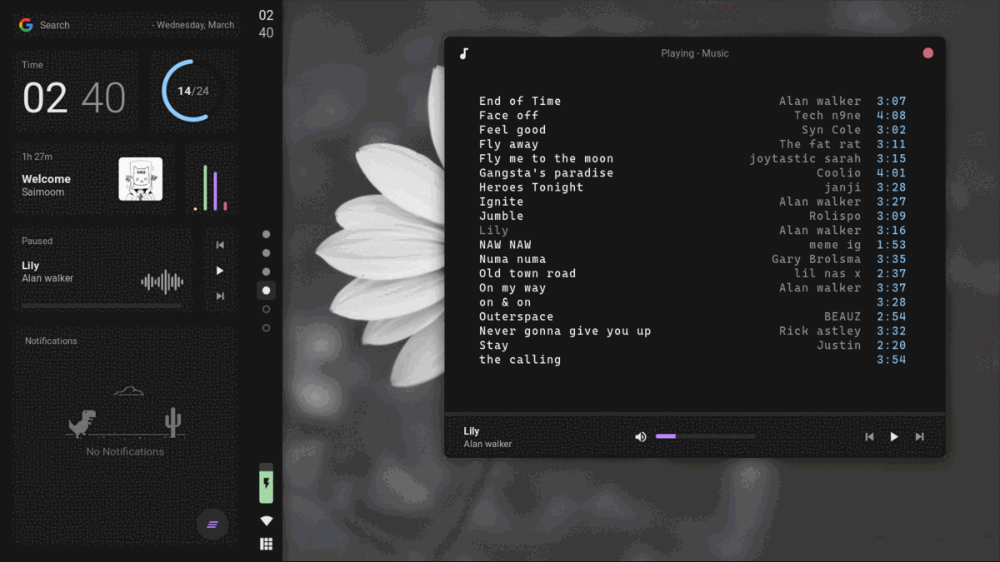
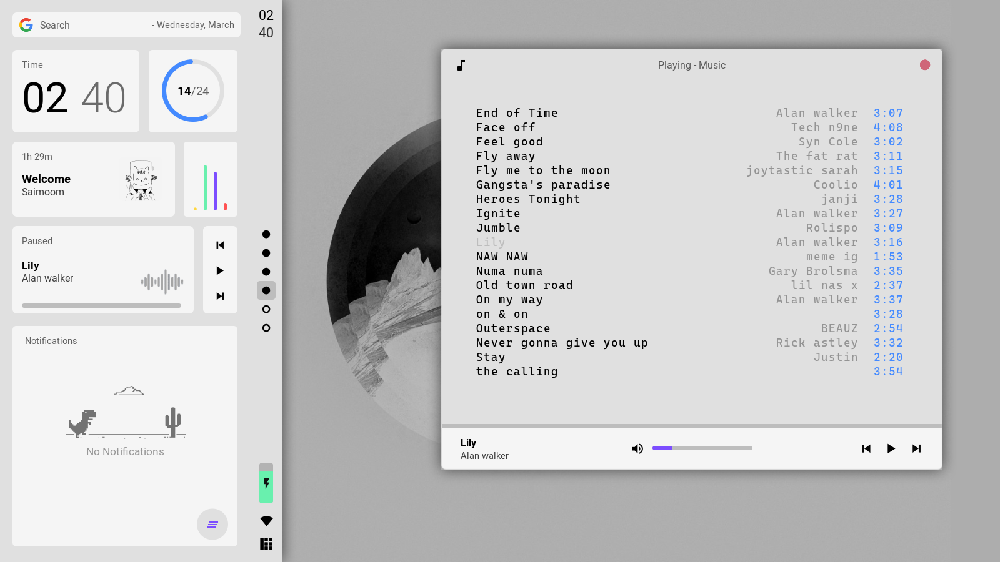
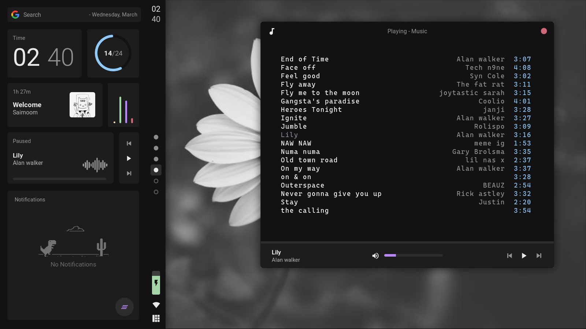

<div align="center">
    
</div>


<br>

    

# Welcome!! 👋

+ [Hello](https://github.com/saimoomedits/dotfiles#welcome-)
    + [Info](https://github.com/saimoomedits/dotfiles#user-info)
    + [Shots](https://github.com/saimoomedits/dotfiles#shots-)
    + [Keybinds](https://github.com/saimoomedits/dotfiles#basic-keybinds-%EF%B8%8F)
+ [Credits](https://github.com/saimoomedits/dotfiles#credits-)


<div align="right">
    
</div>


<br>

**Hello!** welcome to my dotfiles. This is a repo for my linux configs

I use [Awesome-WM](https://awesomewm.org/) which is the most customizable Wm I've ever seen!

As for theme, Its [Material Design](https://material.io). Yes that android one. its really cool!

most things you will need are in the `.config/awesome` folder.

<br>

FYI, I am pretty new to Awesome-WM, so please go easy 😐

<br>


# User Info

**Details**

| Task              | Name                   |
| ----------------- | ---------------------- |
| Window manager    | Awesome-git            |
| Terminal          | Alacritty              |
| Music player      | Mpd / ncmpcpp          |
| gtk theme         | Materia-{Dark/Light}   |
| Bar               | Wibar (not really)     |
| Compositor        | picom-ibhagwan-git     | 

<br>

* you can easily change both light and dark theme by editing thier files in `~/.config/awesome/theme/`
    + **dark.lua** - dark theme
    + **light.lua** - light theme

* the gtk theme can be installed either from the *AUR* or from [here manually](https://github.com/nana-4/materia-theme)

* This setup was indented to work with awesome-git only!

    


<br>


# Shots 📷

<details close>
<summary><strong>Light mode</strong></summary>
    

</details>

<details open>
<summary><strong>Dark mode</strong></summary>
    

</details>

<br>

# Setup 🤖


<details open>
<summary><strong>Arch/ Arch Based</strong></summary>

1. Install packages / dependencies
    
    ```    
    yay -S picom-ibhagwan-git awesome-git acpid git mpd ncmpcpp wmctrl \
    firefox lxappearance gucharmap thunar Alacritty neovim polkit-gnome \
    xdotool xclip scrot brightnessctl alsa-utils pulseaudio jq acpi rofi 
    ```

2. Make backup of directories that will be changed (optional)
    ```
    cd 
    mkdir .backup_config
    cp -r ~/.config/* .backup_config/
    cp -r ~/.mpd .backup_config/
    cp -r ~/.ncmpcpp .backup_config/
    ```

3. Clone this repo
    ```
    cd
    clear
    git clone https://github.com/saimoomedits/dotfiles
    cd dotfiles
    ```

4. Copy the dotfiles in required places
    ```
    cp -rf .config/* ~/.config/
    cp -rf .mpd ~/.mpd
    cp -rf .ncmpcpp ~/.ncmpcpp
    cp -rf .fonts/* ~/.fonts/
    cp -rf .themes/* ~/.themes/
    ```
5. make some files executeable
    ```
    cd ~/.config/awesome/misc
    sudo chmod -R +x *
    ```
6. Done
    <p><b>All done, Now login to awesome-WM</b></p>

<br>


</details>    

<br>

# basic Keybinds ⌨️

| Task              | Keybind               |
| ----------------- | --------------------- |
| terminal          | super + Enter         |
| restart awesome   | super + ctrl + r      |
| exit awesome      | super + shft + e      |
| toggle theme      | super + f             |
| toggle sidebar    | super + z             |
| switch Workspace  | super + 1-6           |

<br>

**For all keybindings, check ```keys.lua``` file**


<br>

# Credits 🙏

**this rice was made possible by the following geniuses:**

* [JavaCafe01](https://github.com/JavaCafe01/dotfiles)
* [Elenapan](https://github.com/elenapan/dotfiles)

<br>

**wallpaper**
* [Moonlight-coffee](https://github.com/moonlight-coffee)

**modules**
* [Rubato](https://github.com/andOrlando/rubato)
* [Bling](https://github.com/BlingCorp/bling)

**Contributers**

<a href="https://github.com/saimoomedits/dotfiles/graphs/contributors">
  
</a>
