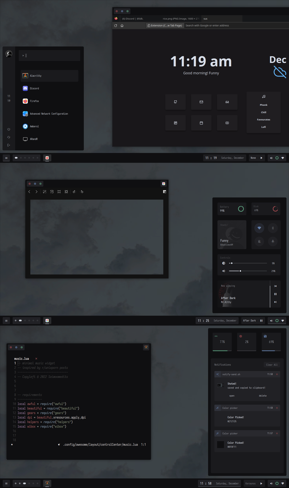

 

 

# <samp><b>Testing branch</b></samp>
## <samp><b>Welcome</b></samp> 

 

<table>

Hi there, thanks for dropping by 💙, 

These are experimental config files for AwesomeWM, 

You can use this repository as a **[rice](https://thatnixguy.github.io/posts/ricing/)** reference.

</table>

 
 

# Credits

- [manas140](https://github.com/manas140)
- [Elenapan](https://github.com/elenapan)
- [Javacafe01](https://github.com/javacafe01)
- [Kasper24](https://github.com/kasper24)
- [Andorlando](https://github.com/andOrlando)
- [manilarome](https://github.com/manilarome)

